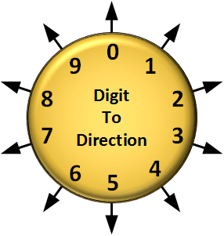

# PlotPI
 
Begin by changing the variable "DigitCount =  10000" to the number of digits you want to plot. 
 
Plot PI() to nth number of digits.  The direction of the plot will be like a 10 digit clock with zero (0) straight up.
 
 Plot direction will be defined by the dictionary xDict and yDict

 xDict = {0: 0, 1: 1.2, 2: 2.4, 3: 2.4, 4: 1.2, 5: 0, 6: -1.2, 7: -2.4, 8: -2.4, 9: -1.2}
 yDict = {0: 3, 1: 1.8, 2: 0.6, 3: -0.6, 4: -1.8, 5: -3, 6: -1.8, 7: -0.6, 8: 0.6, 9: 1.8}
  
So for 3.1415  
  Plot starts out at coordinate x=0, y=0 
  the three (3) will be defined as x=2.4 y=-0.6 from previous location 
      - Decimal is skipped - 
  the one (1) will be defined as x=1.2 y=-1.8 from previous location 
  the four (4) will be defined as x=1.2 y=-1.8 from previous location 
  the one (1) will be defined as x=1.2 y=-1.8 from previous location 
  the five (5) will be defined as x=0 y=-3 from previous location 
 
<strong># Known bugs</strong>
 
The calculated time is now accurate and output's both the times to calculate PI and plotting of digits.
